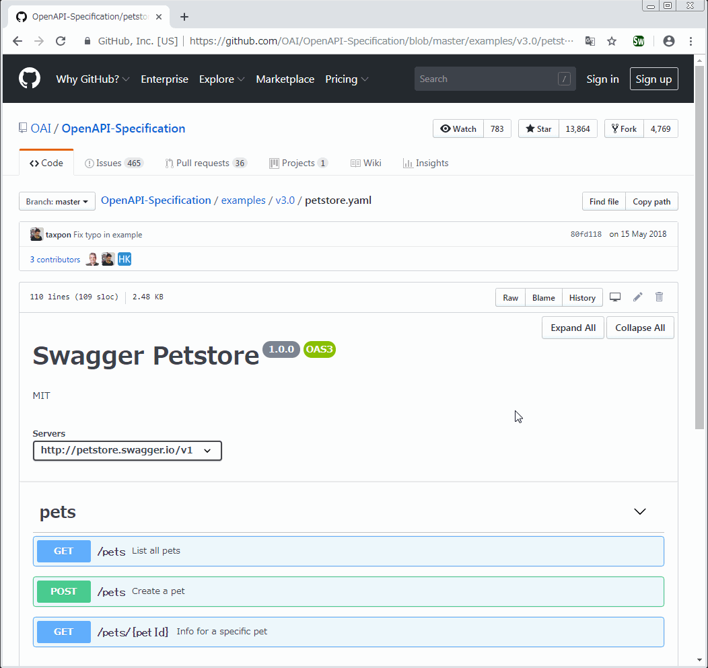

# swagger-viewer

## Overview

This is Chrome Extension.  
<https://chrome.google.com/webstore/detail/swagger-viewer/nfmkaonpdmaglhjjlggfhlndofdldfag>

Shows swagger yaml/json rendered by Swagger-UI.  
This extension replace swagger code into preview html in GitHub.  
Works completely offline.  

## Demo

### Easy to convert

### Easy to expand / collapse

## Spec.

-   Supported sites.
    -   GitHub
-   Supported OpenAPI ver.
    -   2.0
    -   3.0
-   Supported file ext.
    -   yaml
    -   yml
    -   json

## Usage

1.  Install this app from [Chrome webstore](https://chrome.google.com/webstore/detail/swagger-viewer/nfmkaonpdmaglhjjlggfhlndofdldfag)
2.  Open swagger page in GitHub.
    -   Try: <https://github.com/OAI/OpenAPI-Specification/blob/master/examples/v3.0/petstore.yaml>
3.  Click this app icon.
4.  Have a good development!
