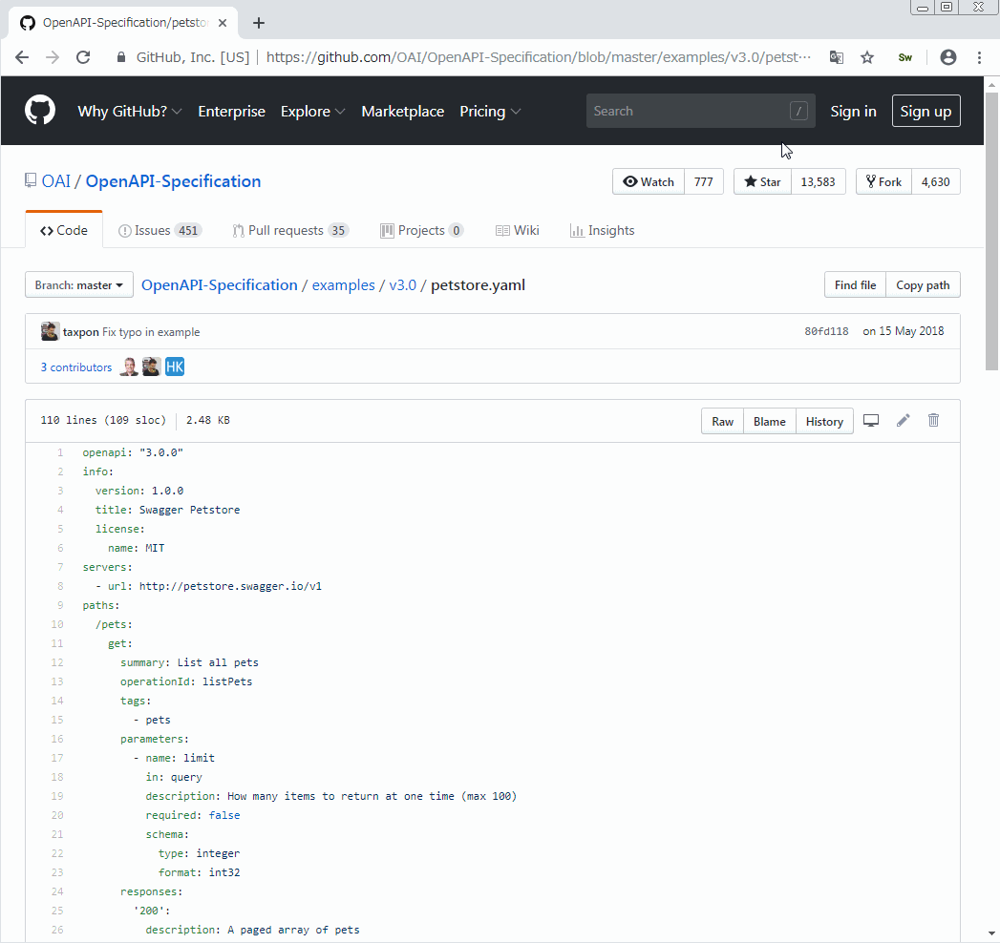

# swagger-viewer

Lorem ipsum dolor sit amet, consectetur adipisicing elit, sed do eiusmod tempor incididunt ut labore et dolore magna aliqua.

## Demo

## Install

    $ npm install

## Development

    npm run dev chrome
    npm run dev firefox
    npm run dev opera
    npm run dev edge

## Build

    npm run build chrome
    npm run build firefox
    npm run build opera
    npm run build edge

## Environment

The build tool also defines a variable named `process.env.NODE_ENV` in your scripts.

## Docs

- [webextension-toolbox](https://github.com/HaNdTriX/webextension-toolbox)

## Swagger examples

https://github.com/OAI/OpenAPI-Specification/tree/master/examples
